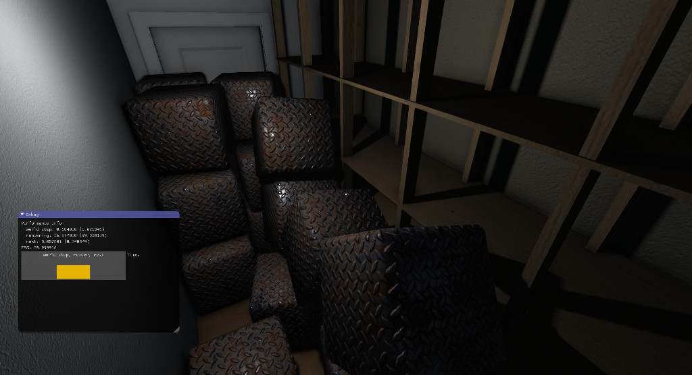
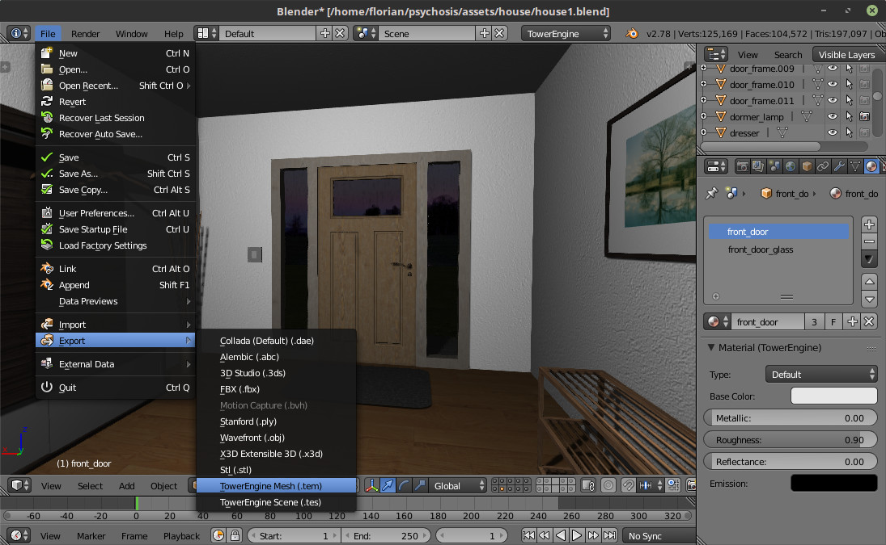

# TowerEngine

[](https://travis-ci.org/thestr4ng3r/towerengine)

TowerEngine is a cross platform OpenGL-based Game Engine developed by Florian Märkl / Metallic Entertainment. It is available under the GPLv3 license.

Please note that this engine was primarily developed for my own projects rather than to be used in other games.
It is currently used in the game "Psychosis" and major changes are made frequently.



## Features

A list of features and characteristics of the engine:
* Uses OpenGL 3.3 Core with ARB_bindless_texture and ARB_shading_language_include extensions
* Physically Based Rendering
* Deferred Rendering
* Soft shadows using Variance Shadow Mapping
* Screen Space Ambient Occlusion
* Bullet Physics integration
* Custom file format for meshes (.tem) and scenes (.tes)
* OpenVR and Oculus support

## Blender Integration

Along with the engine there is a Blender Addon that provides an easy way to create
3D content with materials specifically for TowerEngine and export meshes and scenes.
It is also possible to get a live preview of the scene rendered directly
with TowerEngine in Blender's viewport:



## Building

TowerEngine uses CMake, so it can be built, for example, like this:

```
mkdir build && cd build
cmake ..
make
```

By default, this will build a shared library called `libtowerengine.so`.

These are some options that can be specified to CMake:

| CMake Option                | Description                             |
| --------------------------- | --------------------------------------- |
| `TOWERENGINE_BUILD_STATIC`  | Build static library instead of shared. |
| `TOWERENGINE_ENABLE_IMGUI`  | Build with ImGUI support.               |
| `TOWERENGINE_BUILD_DEVIL`   | Use DevIL for texture loading.          |
| `TOWERENGINE_BUILD_LIBPNG`  | Use LibPNG for texture loading.         |
| `TOWERENGINE_BUILD_OPENVR`  | Build with OpenVR support.              |
| `TOWERENGINE_BUILD_OCULUS`  | Build with Oculus support.              |
| `TOWERENGINE_SWIG_PYTHON`   | Generate Python Bindings using SWIG.    |
| `TOWERENGINE_BLENDER_ADDON` | Package Blender Addon.                  |

## About
Created by Florian Märkl: https://www.metallic.software

This program is free software: you can redistribute it and/or modify
it under the terms of the GNU Lesser General Public License as published by
the Free Software Foundation, either version 3 of the License, or
(at your option) any later version.

This program is distributed in the hope that it will be useful,
but WITHOUT ANY WARRANTY; without even the implied warranty of
MERCHANTABILITY or FITNESS FOR A PARTICULAR PURPOSE.  See the
GNU Lesser General Public License for more details.

You should have received a copy of the GNU Lesser General Public License
along with this program.  If not, see <http://www.gnu.org/licenses/>.